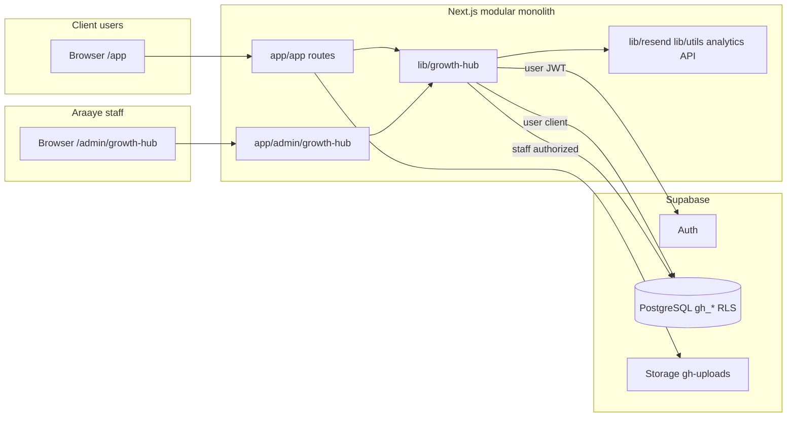

# Growth Hub — Architecture

**Status:** Sprint 0  
**Decisions:** [DECISIONS.md](./DECISIONS.md)

---

## 1. System context



**Out of scope (unchanged products):** `/ai`, `/adready`, `/dashboard/adready`, `/fastweb`, CRM `/admin/manager`, legacy `/support`.

---

## 2. Layers

| Layer | Location | Responsibility |
|-------|----------|----------------|
| Presentation (client) | `app/app/**`, `components/growth-hub/**` | Persian RTL portal UI |
| Presentation (staff) | `app/admin/growth-hub/**`, `components/growth-hub/admin/**` | Ops UI under existing admin middleware |
| Application | `lib/growth-hub/*.ts` | Permissions, use-cases, validation |
| Domain | Types + state enums in `lib/growth-hub/types.ts` | Status transitions, invariants |
| Infrastructure | `lib/growth-hub/supabase/*`, email, analytics | SSR clients, storage, events |
| Data | `gh_*` tables, RLS, storage policies | Tenant isolation |

---

## 3. Authentication flows

### 3.1 Client (`/app/*`)

1. User signs in via Supabase Auth (magic link or password).
2. Middleware refreshes session cookie (`@supabase/ssr`).
3. Layout resolves `gh_profiles` and `gh_workspace_members`.
4. `[workspaceSlug]` layout verifies slug ↔ membership.
5. All reads: user-scoped Supabase client → RLS.

### 3.2 Staff (`/admin/growth-hub/*`)

1. Existing `/admin` middleware validates `ary_admin` cookie.
2. Route handlers / Server Actions call `assertGrowthHubStaffAccess({ workspaceId?, requiredRole })`.
3. Mutations use service-role client **only inside** authorized functions.
4. Audit: `gh_activity_events` for sensitive changes.

**No** merging client Supabase session with `ary_admin` in one browser tab policy — staff use admin panel; clients use portal.

---

## 4. Authorization model

### Workspace roles (membership)

- `client_owner` — manage client members, full client read (except internal fields)
- `client_member` — standard client read/write per matrix
- `araaye_manager` — staff scoped to workspace (update services, requests, reports draft, etc.)

### Global staff

- `araaye_admin` — all workspaces; member management; entitlements

### Account manager (MVP)

- Assigned only via `gh_workspace_members.role = 'araaye_manager'` (active). **No** `account_manager_id` on `gh_workspaces` (D-022).

### Enforcement order

1. Postgres RLS (client JWT)
2. Server mutation guards (staff + column-level rules)
3. UI hiding (non-security)

---

## 5. Module boundaries

```text
lib/growth-hub/
  supabase/          # browser.ts, server.ts, middleware.ts — portal only
  auth.ts            # requirePortalSession, getMembership
  staffAuth.ts       # assertGrowthHubStaffAccess + service role gateway
  permissions.ts     # role × action matrix (mirrors rls-matrix)
  workspace.ts
  services.ts
  requests.ts
  reports.ts
  opportunities.ts
  files.ts
  invoices.ts
  activity.ts
  notifications.ts
  analytics.ts
  types.ts
  constants.ts
```

**Forbidden imports in `lib/growth-hub`:** `lib/ai*`, `lib/adready*` (domain). Allowed: `lib/utils`, `lib/resend`, `lib/supabase` only from `staffAuth.ts` gateway.

---

## 6. Request / data flow (client read)

```text
page.tsx (Server Component)
  → getGrowthHubServerClient()
  → supabase.from('gh_services').select(...)
  → RLS filters by workspace_id + role
  → render
```

---

## 7. Request / data flow (staff write)

```text
Server Action / route.ts
  → getAdminSession() // existing
  → assertGrowthHubStaffAccess(...)
  → getSupabaseAdmin() // only here
  → insert/update + gh_activity_events
```

---

## 8. Cross-cutting concerns

| Concern | Approach |
|---------|----------|
| i18n | Persian copy in components; paths in English |
| RTL | Root `dir=rtl`; logical CSS in Growth Hub components |
| Email | Resend templates in `lib/growth-hub/email/` (Sprint 1+) |
| Notifications | `gh_notifications` + email for MVP events (PRD §19) |
| Errors | No tenant leakage in messages (“یافت نشد” vs “دسترسی ندارید”) |
| SEO | `noindex` on `/app/*` |

---

## 9. Deployment

- **Host:** Vercel (existing `vercel.json` redirects apply to `/app`).
- **Env:** `SUPABASE_URL`, anon key (public), service role (server only), `ADMIN_SESSION_SECRET`, Resend, site URL for auth redirects.
- **Migrations:** `supabase/migrations/*_gh_*.sql` (Sprint 1+).

---

## 10. Relation to legacy systems

| Legacy | Growth Hub relationship |
|--------|-------------------------|
| `crm_clients` | Optional `gh_workspaces.crm_client_id` for ops reference |
| `support_projects` | Optional `support_project_id`; `/support` unchanged |
| `public.invoices` | Separate from `gh_invoices` |
| Product dashboards | No redirect merge in MVP |

---

## 11. Engineering prerequisites

### Sprint 1A (visual)

1. `components/growth-hub/theme/portal-tokens.css`
2. `/dev/growth-hub` page with fixtures + dev-only guard
3. G1 visual sign-off

### Sprint 1B (production foundation — after G1)

1. Add `@supabase/ssr`
2. Portal middleware matcher for session refresh
3. `PublicOnlyChrome` exclude `/app`
4. `gh_*` foundation migration + RLS functions (no `account_manager_id`)
5. Generated types (`lib/growth-hub/database.types.ts`)

See [IMPLEMENTATION-PLAN.md](./IMPLEMENTATION-PLAN.md).
