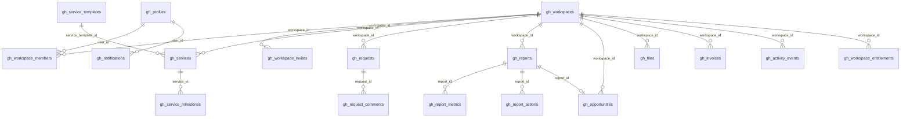

# Growth Hub — Data Model (ERD Specification)

**Status:** Sprint 0 — specification only (no migration SQL)  
**Prefix:** `gh_`  
**Tenancy:** `workspace_id` on all tenant-owned rows  
**RLS detail:** [rls-matrix.md](./rls-matrix.md)

---

## Entity relationship overview

---

## Shared enums (application-level; enforce via CHECK in migrations)

### `gh_workspace_status`

`active` | `suspended` | `archived`

### `gh_member_role`

`client_owner` | `client_member` | `araaye_manager`

### `gh_member_status`

`invited` | `active` | `removed`

### `gh_service_status`

`starting` | `active` | `in_progress` | `waiting_on_client` | `paused` | `completed` | `cancelled`

### `gh_request_status`

`new` | `triage` | `in_progress` | `waiting_on_client` | `done` | `closed`

### `gh_report_status`

`draft` | `published` | `viewed` | `acknowledged`

### `gh_opportunity_status`

`draft` | `visible` | `viewed` | `proposal_requested` | `in_negotiation` | `won` | `lost` | `expired`

### `gh_invoice_status`

`not_issued` | `issued` | `pending_payment` | `paid` | `overdue` | `cancelled`

### `gh_file_visibility`

`client` | `client_owner_only` | `staff_only`

### `gh_file_category`

`contract` | `proforma` | `invoice` | `design` | `report` | `client_content` | `deliverable` | `access_doc` | `other`

---

## RLS helper functions (to implement in migration)

Documented here; defined in SQL Sprint 1.

| Function | Purpose |
|----------|---------|
| `gh_current_profile_id()` | `auth.uid()` cast; must exist in `gh_profiles` |
| `gh_is_active_member(ws uuid, roles text[] default null)` | Member `status = active` and optional role filter |
| `gh_is_staff_admin()` | Staff global admin |
| `gh_is_workspace_manager(ws uuid)` | Active `gh_workspace_members` with `role = 'araaye_manager'` and `status = 'active'` for `ws` |
| `gh_can_staff_access_workspace(ws uuid)` | `gh_is_staff_admin()` OR `gh_is_workspace_manager(ws)` |

---

## Table specifications

### `gh_profiles`

| | |
|--|--|
| **Purpose** | Application profile for each Supabase Auth user participating in Growth Hub. |
| **Tenant ownership** | Global per user (not workspace-scoped). |

**Columns**

| Column | Type | Nullable | Default | Notes |
|--------|------|----------|---------|-------|
| `id` | uuid | NO | — | PK, FK → `auth.users.id` ON DELETE CASCADE |
| `full_name` | text | YES | — | Display name |
| `phone` | text | YES | — | E.164 or local normalized; not unique in MVP |
| `avatar_url` | text | YES | — | |
| `preferred_locale` | text | NO | `'fa'` | |
| `created_at` | timestamptz | NO | `now()` | |
| `updated_at` | timestamptz | NO | `now()` | |

**Constraints:** PK (`id`).  
**Unique:** —  
**Indexes:** `gh_profiles_phone_idx` on `(phone)` where phone is not null (optional lookup).  
**Soft delete:** No; account deletion cascades from Auth.  
**Audit:** `updated_at` on change; staff may not impersonate client profile without audit event.

**Access (summary)**

| Op | client_owner | client_member | araaye_manager | araaye_admin | anon | service role |
|----|--------------|---------------|----------------|--------------|------|--------------|
| SELECT | own row | own row | own + members in assigned ws | all | deny | staff mutations only |
| INSERT | own on first login | own | deny | deny | deny | bootstrap invite accept |
| UPDATE | own | own | deny | staff fix | deny | staff |
| DELETE | deny | deny | deny | deny | deny | cascade from Auth |

---

### `gh_workspaces`

| | |
|--|--|
| **Purpose** | Tenant root: one customer business workspace. |
| **Tenant ownership** | Row is the tenant; `id` used as `workspace_id` elsewhere. |

**Columns**

| Column | Type | Nullable | Default | Notes |
|--------|------|----------|---------|-------|
| `id` | uuid | NO | `gen_random_uuid()` | PK |
| `name` | text | NO | — | Business name |
| `slug` | text | NO | — | URL segment; lowercase `[a-z0-9-]` |
| `logo_url` | text | YES | — | |
| `industry` | text | YES | — | |
| `website_url` | text | YES | — | |
| `status` | text | NO | `'active'` | enum `gh_workspace_status` |
| `crm_client_id` | uuid | YES | — | Optional → `crm_clients.id`; reference only, no sync |
| `support_project_id` | uuid | YES | — | Optional → `support_projects.id` |
| `created_at` | timestamptz | NO | `now()` | |
| `updated_at` | timestamptz | NO | `now()` | |
| `archived_at` | timestamptz | YES | — | Soft archive |

**Not in MVP schema:** `account_manager_id` — use `gh_workspace_members` with `role = 'araaye_manager'` (see DECISIONS D-022).

**Constraints:** CHECK slug format; CHECK status enum.  
**Unique:** `slug` globally unique.  
**Indexes:** `gh_workspaces_slug_uidx` unique; `gh_workspaces_status_idx`.  
**Soft delete:** `archived_at` + `status = archived`; no hard delete in MVP.  
**Audit:** Create/archive → `gh_activity_events`. Manager assign/remove → membership audit events.

**Access:** See rls-matrix (members SELECT; staff admin all; manager assigned only).

---

### `gh_workspace_members`

| | |
|--|--|
| **Purpose** | Links users to workspaces with role. |
| **Tenant ownership** | `workspace_id` |

**Columns**

| Column | Type | Nullable | Default | Notes |
|--------|------|----------|---------|-------|
| `id` | uuid | NO | `gen_random_uuid()` | PK |
| `workspace_id` | uuid | NO | — | FK → `gh_workspaces.id` ON DELETE CASCADE |
| `user_id` | uuid | NO | — | FK → `gh_profiles.id` ON DELETE CASCADE |
| `role` | text | NO | — | `gh_member_role` |
| `status` | text | NO | `'invited'` | `gh_member_status` |
| `invited_at` | timestamptz | YES | — | |
| `joined_at` | timestamptz | YES | — | |
| `invited_by` | uuid | YES | — | FK → `gh_profiles.id` |
| `created_at` | timestamptz | NO | `now()` | |
| `updated_at` | timestamptz | NO | `now()` | |

**Unique:** `(workspace_id, user_id)`.  
**Indexes:** `gh_workspace_members_user_idx` (`user_id`, `status`); `gh_workspace_members_ws_idx`; `gh_workspace_members_manager_idx` on `(user_id, workspace_id)` WHERE `role = 'araaye_manager' AND status = 'active'` (manager workspace queries).  
**Soft delete:** `status = removed` (no row delete by clients).  
**Audit:** Role/status changes logged; **assigning `araaye_manager` is the only MVP way to designate account manager.**

**Access:** client_owner may INSERT/UPDATE client roles only; not `araaye_manager`; staff per matrix.

---

### `gh_workspace_invites`

| | |
|--|--|
| **Purpose** | Time-limited invite tokens before user has membership. |
| **Tenant ownership** | `workspace_id` |

**Columns**

| Column | Type | Nullable | Default | Notes |
|--------|------|----------|---------|-------|
| `id` | uuid | NO | `gen_random_uuid()` | PK |
| `workspace_id` | uuid | NO | — | FK → `gh_workspaces` |
| `email` | text | YES | — | At least one of email/phone |
| `phone` | text | YES | — | |
| `role` | text | NO | — | Target `gh_member_role` (not araaye_admin) |
| `token_hash` | text | NO | — | SHA-256 of secret token; never store raw |
| `expires_at` | timestamptz | NO | — | |
| `accepted_at` | timestamptz | YES | — | |
| `accepted_by` | uuid | YES | — | FK → `gh_profiles.id` |
| `created_by` | uuid | NO | — | Staff profile |
| `created_at` | timestamptz | NO | `now()` | |

**Unique:** `token_hash`.  
**Indexes:** `gh_workspace_invites_ws_idx`; `gh_workspace_invites_expires_idx`.  
**Soft delete:** Revoke = set `expires_at` in past or delete row (staff only).  
**Audit:** create/revoke/accept.

**Access:** Clients never SELECT token_hash; accept via server route with anon + token verification.

---

### `gh_service_templates`

| | |
|--|--|
| **Purpose** | Catalog of service types (FastWeb, SEO, …). |
| **Tenant ownership** | Global (not workspace-scoped). |

**Columns**

| Column | Type | Nullable | Default | Notes |
|--------|------|----------|---------|-------|
| `id` | uuid | NO | `gen_random_uuid()` | PK |
| `key` | text | NO | — | Stable key e.g. `fastweb` |
| `title` | text | NO | — | Persian title |
| `description` | text | YES | — | |
| `default_milestones` | jsonb | NO | `'[]'` | Array of `{title, sort_order}` |
| `is_active` | boolean | NO | `true` | |
| `created_at` | timestamptz | NO | `now()` | |
| `updated_at` | timestamptz | NO | `now()` | |

**Unique:** `key`.  
**Indexes:** `gh_service_templates_active_idx`.  
**Access:** All members SELECT active; staff INSERT/UPDATE; clients deny write.

---

### `gh_services`

| | |
|--|--|
| **Purpose** | Service instance for a workspace (contract line). |
| **Tenant ownership** | `workspace_id` |

**Columns**

| Column | Type | Nullable | Default | Notes |
|--------|------|----------|---------|-------|
| `id` | uuid | NO | `gen_random_uuid()` | PK |
| `workspace_id` | uuid | NO | — | FK |
| `service_template_id` | uuid | YES | — | FK → templates |
| `title` | text | NO | — | |
| `status` | text | NO | `'starting'` | `gh_service_status` |
| `progress` | smallint | NO | `0` | 0–100 CHECK |
| `owner_id` | uuid | YES | — | Staff assignee → `gh_profiles` |
| `start_date` | date | YES | — | |
| `due_date` | date | YES | — | |
| `renewal_date` | date | YES | — | |
| `latest_update` | text | YES | — | Client-visible summary |
| `next_action` | text | YES | — | |
| `waiting_reason` | text | YES | — | Required when status `waiting_on_client` |
| `created_at` | timestamptz | NO | `now()` | |
| `updated_at` | timestamptz | NO | `now()` | |

**Indexes:** `(workspace_id, status)`; `(owner_id)`.  
**Audit:** Status changes → `gh_activity_events`.  
**Access:** Clients SELECT; staff UPDATE status/fields; clients deny UPDATE.

---

### `gh_service_milestones`

| | |
|--|--|
| **Purpose** | Milestone steps for a service. |
| **Tenant ownership** | Via `service_id` → workspace |

**Columns**

| Column | Type | Nullable | Default | Notes |
|--------|------|----------|---------|-------|
| `id` | uuid | NO | `gen_random_uuid()` | PK |
| `service_id` | uuid | NO | — | FK → `gh_services` ON DELETE CASCADE |
| `title` | text | NO | — | |
| `status` | text | NO | `'pending'` | `pending` \| `in_progress` \| `completed` \| `skipped` |
| `sort_order` | int | NO | `0` | |
| `due_date` | date | YES | — | |
| `completed_at` | timestamptz | YES | — | |
| `created_at` | timestamptz | NO | `now()` | |
| `updated_at` | timestamptz | NO | `now()` | |

**Unique:** `(service_id, sort_order)` optional or enforce in app.  
**Indexes:** `(service_id, sort_order)`.  
**Access:** Clients SELECT; staff UPDATE.

---

### `gh_requests`

| | |
|--|--|
| **Purpose** | Formal client requests (not chat). |
| **Tenant ownership** | `workspace_id` |

**Columns**

| Column | Type | Nullable | Default | Notes |
|--------|------|----------|---------|-------|
| `id` | uuid | NO | `gen_random_uuid()` | PK |
| `workspace_id` | uuid | NO | — | FK |
| `service_id` | uuid | YES | — | FK → `gh_services` |
| `created_by` | uuid | NO | — | FK → `gh_profiles` |
| `assigned_to` | uuid | YES | — | Staff profile |
| `type` | text | NO | — | PRD types (change, technical, …) |
| `priority` | text | NO | `'normal'` | `low` \| `normal` \| `high` (staff sets final) |
| `title` | text | NO | — | |
| `description` | text | YES | — | |
| `status` | text | NO | `'new'` | `gh_request_status` |
| `due_at` | timestamptz | YES | — | SLA hint |
| `created_at` | timestamptz | NO | `now()` | |
| `updated_at` | timestamptz | NO | `now()` | |
| `resolved_at` | timestamptz | YES | — | |

**Indexes:** `(workspace_id, status)`; `(assigned_to, status)`.  
**Access:** Clients INSERT; SELECT own workspace; staff assign/priority/status.

---

### `gh_request_comments`

| | |
|--|--|
| **Purpose** | Thread comments on requests. |
| **Tenant ownership** | Via request → workspace |

**Columns**

| Column | Type | Nullable | Default | Notes |
|--------|------|----------|---------|-------|
| `id` | uuid | NO | `gen_random_uuid()` | PK |
| `request_id` | uuid | NO | — | FK CASCADE |
| `author_id` | uuid | NO | — | FK → `gh_profiles` |
| `body` | text | NO | — | |
| `is_internal` | boolean | NO | `false` | **Internal-only** — hidden from clients in API |
| `created_at` | timestamptz | NO | `now()` | |

**Indexes:** `(request_id, created_at)`.  
**RLS:** Clients SELECT where `is_internal = false`; staff SELECT all.

---

### `gh_reports`

| | |
|--|--|
| **Purpose** | Periodic performance reports. |
| **Tenant ownership** | `workspace_id` |

**Columns**

| Column | Type | Nullable | Default | Notes |
|--------|------|----------|---------|-------|
| `id` | uuid | NO | `gen_random_uuid()` | PK |
| `workspace_id` | uuid | NO | — | FK |
| `title` | text | NO | — | |
| `period_start` | date | NO | — | |
| `period_end` | date | NO | — | |
| `executive_summary` | text | YES | — | |
| `status` | text | NO | `'draft'` | `gh_report_status` |
| `created_by` | uuid | NO | — | Staff |
| `published_at` | timestamptz | YES | — | |
| `published_snapshot` | jsonb | YES | — | **Immutable** after publish |
| `viewed_at` | timestamptz | YES | — | First client view |
| `acknowledged_at` | timestamptz | YES | — | |
| `created_at` | timestamptz | NO | `now()` | |
| `updated_at` | timestamptz | NO | `now()` | |

**Indexes:** `(workspace_id, status)`; `(published_at desc)`.  
**Access:** Clients SELECT `published`+ only; staff draft CRUD until publish; no client UPDATE.

---

### `gh_report_metrics`

| | |
|--|--|
| **Purpose** | KPI rows for a report (max 6 in MVP UI). |
| **Tenant ownership** | Via `report_id` |

**Columns**

| Column | Type | Nullable | Default | Notes |
|--------|------|----------|---------|-------|
| `id` | uuid | NO | `gen_random_uuid()` | PK |
| `report_id` | uuid | NO | — | FK CASCADE |
| `metric_key` | text | NO | — | e.g. `visits` |
| `label` | text | NO | — | Persian label |
| `value` | numeric | YES | — | |
| `previous_value` | numeric | YES | — | |
| `unit` | text | YES | — | |
| `source` | text | YES | — | `manual` \| `tracker` \| … |
| `explanation` | text | YES | — | |
| `sort_order` | int | NO | `0` | |

**Access:** Same as parent report visibility; snapshot copied into `published_snapshot` on publish.

---

### `gh_report_actions`

| | |
|--|--|
| **Purpose** | Completed work, findings, next-period actions. |
| **Tenant ownership** | Via `report_id` |

**Columns**

| Column | Type | Nullable | Default | Notes |
|--------|------|----------|---------|-------|
| `id` | uuid | NO | `gen_random_uuid()` | PK |
| `report_id` | uuid | NO | — | FK |
| `title` | text | NO | — | |
| `kind` | text | NO | — | `completed_work` \| `finding` \| `next_action` |
| `type` | text | YES | — | Optional subtype |
| `status` | text | YES | — | For next actions |
| `sort_order` | int | NO | `0` | |

---

### `gh_opportunities`

| | |
|--|--|
| **Purpose** | Evidence-based upsell cards. |
| **Tenant ownership** | `workspace_id` |

**Columns**

| Column | Type | Nullable | Default | Notes |
|--------|------|----------|---------|-------|
| `id` | uuid | NO | `gen_random_uuid()` | PK |
| `workspace_id` | uuid | NO | — | FK |
| `report_id` | uuid | YES | — | Optional link |
| `title` | text | NO | — | |
| `evidence` | text | NO | — | Required for visible |
| `problem` | text | NO | — | |
| `recommendation` | text | NO | — | |
| `expected_outcome` | text | NO | — | |
| `price_from` | text | YES | — | «شروع از» |
| `status` | text | NO | `'draft'` | `gh_opportunity_status` |
| `visible_from` | timestamptz | YES | — | |
| `expires_at` | timestamptz | YES | — | |
| `rejected_until` | timestamptz | YES | — | 60-day cap after reject |
| `created_by` | uuid | NO | — | Staff |
| `created_at` | timestamptz | NO | `now()` | |
| `updated_at` | timestamptz | NO | `now()` | |

**Access:** Clients SELECT `visible`+; max 2 visible enforced in app; staff publish.

---

### `gh_files`

| | |
|--|--|
| **Purpose** | File metadata; bytes in `gh-uploads` storage. |
| **Tenant ownership** | `workspace_id` |

**Columns**

| Column | Type | Nullable | Default | Notes |
|--------|------|----------|---------|-------|
| `id` | uuid | NO | `gen_random_uuid()` | PK |
| `workspace_id` | uuid | NO | — | FK |
| `service_id` | uuid | YES | — | |
| `request_id` | uuid | YES | — | |
| `report_id` | uuid | YES | — | |
| `uploaded_by` | uuid | NO | — | FK profile |
| `category` | text | NO | `'other'` | `gh_file_category` |
| `name` | text | NO | — | |
| `storage_path` | text | NO | — | `{workspace_id}/...` |
| `mime_type` | text | YES | — | |
| `size_bytes` | bigint | NO | `0` | |
| `visibility` | text | NO | `'client'` | `gh_file_visibility` |
| `created_at` | timestamptz | NO | `now()` | |
| `deleted_at` | timestamptz | YES | — | Soft delete |

**Indexes:** `(workspace_id, category)`; `(storage_path)` unique.  
**Access:** SELECT filtered by visibility; INSERT clients for allowed categories; staff all.

---

### `gh_invoices`

| | |
|--|--|
| **Purpose** | Client-visible invoice status (not accounting). |
| **Tenant ownership** | `workspace_id` |

**Columns**

| Column | Type | Nullable | Default | Notes |
|--------|------|----------|---------|-------|
| `id` | uuid | NO | `gen_random_uuid()` | PK |
| `workspace_id` | uuid | NO | — | FK |
| `service_id` | uuid | YES | — | |
| `title` | text | NO | — | |
| `amount` | numeric(14,0) | NO | — | |
| `currency` | text | NO | `'IRR'` | |
| `status` | text | NO | `'not_issued'` | `gh_invoice_status` |
| `issued_at` | date | YES | — | |
| `due_at` | date | YES | — | |
| `paid_at` | timestamptz | YES | — | Manual staff |
| `payment_url` | text | YES | — | External link |
| `file_id` | uuid | YES | — | FK → `gh_files` |
| `created_at` | timestamptz | NO | `now()` | |
| `updated_at` | timestamptz | NO | `now()` | |

**Note:** Distinct from `public.invoices` (CRM).

---

### `gh_activity_events`

| | |
|--|--|
| **Purpose** | Audit and activity feed. |
| **Tenant ownership** | `workspace_id` |

**Columns**

| Column | Type | Nullable | Default | Notes |
|--------|------|----------|---------|-------|
| `id` | uuid | NO | `gen_random_uuid()` | PK |
| `workspace_id` | uuid | NO | — | FK |
| `actor_id` | uuid | YES | — | Null = system |
| `entity_type` | text | NO | — | `service`, `request`, … |
| `entity_id` | uuid | NO | — | |
| `event_type` | text | NO | — | `status_changed`, … |
| `metadata` | jsonb | NO | `'{}'` | No PII secrets |
| `created_at` | timestamptz | NO | `now()` | |

**Access:** Clients SELECT client-visible event types only (server filter or `visibility` column in metadata); staff SELECT all; INSERT staff/system only.

---

### `gh_notifications`

| | |
|--|--|
| **Purpose** | In-app notifications per user. |
| **Tenant ownership** | `workspace_id` + `user_id` |

**Columns**

| Column | Type | Nullable | Default | Notes |
|--------|------|----------|---------|-------|
| `id` | uuid | NO | `gen_random_uuid()` | PK |
| `user_id` | uuid | NO | — | FK → `gh_profiles` |
| `workspace_id` | uuid | NO | — | FK |
| `type` | text | NO | — | `report_published`, … |
| `title` | text | NO | — | |
| `body` | text | YES | — | |
| `target_url` | text | YES | — | |
| `read_at` | timestamptz | YES | — | |
| `created_at` | timestamptz | NO | `now()` | |

**Access:** Users SELECT/UPDATE own rows only.

---

### `gh_workspace_entitlements`

| | |
|--|--|
| **Purpose** | Feature flags / limits per workspace (future tiers). |
| **Tenant ownership** | `workspace_id` |

**Columns**

| Column | Type | Nullable | Default | Notes |
|--------|------|----------|---------|-------|
| `id` | uuid | NO | `gen_random_uuid()` | PK |
| `workspace_id` | uuid | NO | — | FK |
| `feature_key` | text | NO | — | e.g. `growth_monitoring` |
| `enabled` | boolean | NO | `false` | |
| `limits` | jsonb | NO | `'{}'` | |
| `expires_at` | timestamptz | YES | — | |
| `created_at` | timestamptz | NO | `now()` | |
| `updated_at` | timestamptz | NO | `now()` | |

**Unique:** `(workspace_id, feature_key)`.  
**Access:** Clients SELECT enabled flags only; staff CRUD.

---

## Storage objects (`gh-uploads`)

| Rule | Detail |
|------|--------|
| Key pattern | `{workspace_id}/{file_id}/{sanitized_name}` |
| Max size | TBD in migration (e.g. 25MB MVP) |
| MIME allowlist | images, pdf, docx, zip |

Metadata authoritative in `gh_files`; storage policies mirror RLS (see rls-matrix).

---

## Migration sequencing (reference)

1. Profiles, workspaces, members, invites + RLS helpers  
2. Service templates, services, milestones  
3. Requests, comments  
4. Reports, metrics, actions  
5. Opportunities, files, invoices  
6. Activity, notifications, entitlements  
7. Storage bucket policies  

SQL not written in Sprint 0.
